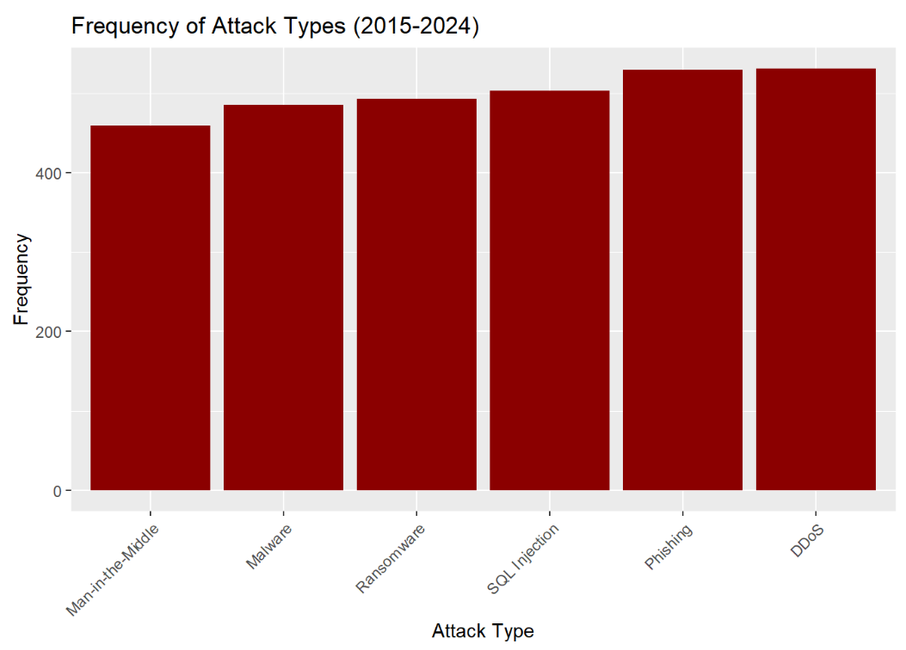
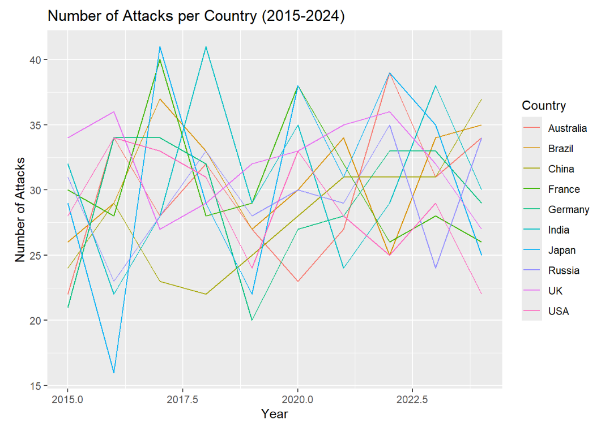

# Cyber Attack Analysis (2015-2024)

**Author:** Yailin Corona-Ruezga
**Degree Program:** Data Science

---

## Project Overview
This project analyzes global cybersecurity attack data from **2015 to 2024** to identify trends across countries, industries, and attack types. The analysis focuses on understanding where attacks are most frequent, which industries are most impacted, and how factors such as financial loss, affected users, and response time vary over time. 

This project was completed as a part of DAT301 and has been refined for portfolio presentation. 

---

## Objectives 
- Identify countries with the highest frequency of cyber attacks
- Analyze the most common attack types
- Examine which industries are most affected
- Explore trends in financial loss, affected users, and response time
- Practice reproducible data analysis using R and R Markdown
  
---

## Tools and Technologies
- R / RStudio
- tidyverse (dplyr, ggplot2)

## Dataset
The dataset used in this project is 88global Cybersecurity Threats (2015-2024)**, sourced from Kaggle. 

Dataset download instructions are provided in:
`data?dataset-link.md` 

---

## Repository Structure
cyber-attack-analysis/

---

## Full Analysis Report
The complete analysis including code, visualizations, and written interpretation, is available as an HTML report:
**[View the full HTML report](outputs/DAT301-Project1.html)**

---

## Process Summary
1. Data acquisition & cleaning
2. Exploratory Data Analysis (EDA): key features/visuals
3. Advanced analysis: model / clustering / insights
4. Visualizations & findings

---

## Key Insights
Some insights explored in this project include:
- Differences in cyber attack frequency across countries
- Most common types of cyber atacks globally
- Industries most vulnerable to cyber threats
- Variation in finncial losses and number of affected users
- Trends in response time over the 10-year period

## Selected Visualizations
### Cyber Attacks by Country
This chart shows the distribution of reported cyber attacks across countries between 2015-2024.


### Most Common Attack Types
A breakdown of the most frequently observed cyber attack methods.


### Attack by Industry
Industries most affected by cyber attacks over the 10-year period.


### Attacks Over Time
An overview of the attacks per country across the 10 year period for each country. 


(See HTML report for detailed results and visualizations)

---

## How to Reproduce This Analysis
1. Download the dataset using the instructions in `data/dataset-link.md`
2. Open `code/Dat301-Project1.Rmd` in RStudio
3. Install required packages:
   ```r
   install.packages(c("tidyverse", "janitor", "rmarkdown"))
